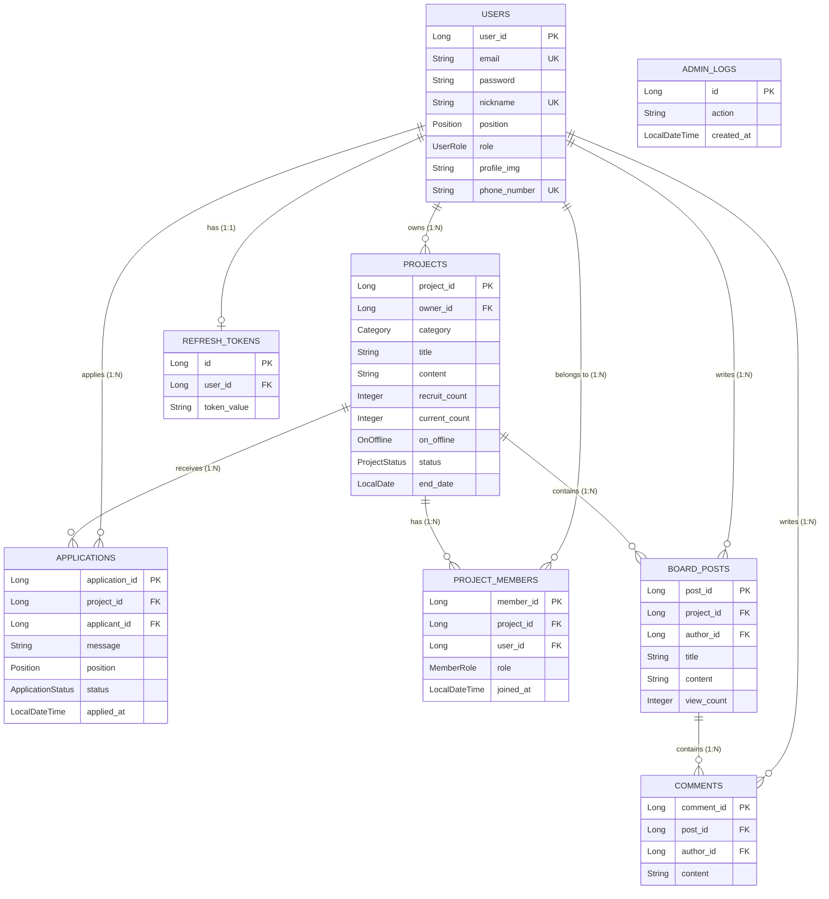

## 💻 Backend-MATE

## 📖 소개 및 개요
- **목적**: 효율적인 팀 매칭과 스터디 모집 과정을 자동화하고 관리하기 위한 RESTful API 서버입니다.

####  서비스 소개  

- **Backend-MATE**는 팀 프로젝트 및 스터디원 모집을 위한 협업 플랫폼의 백엔드 애플리케이션입니다. 
- 사용자들은 자신의 기술 스택과 포지션을 설정하여 팀원을 찾거나, 원하는 프로젝트에 지원하여 함께 협업할 수 있습니다.
- 신속한 팀원 모집 및 지원 프로세스 제공
- 기술 스택 및 포지션 기반의 사용자 프로필 관리
- 프로젝트별 게시판 및 댓글을 통한 원활한 소통 지원
- 관리자 대시보드를 통한 서비스 모니터링 및 데이터 관리

<br> 

## ✨ Backend-MATE 구경하기 

<details>
<summary>목차</summary>
   
- [팀 소개](#teamintro)
- [핵심 도메인 및 ERD 개요](#erd)
- [주요 API 기능](#api)
- [기술 스택 (Tech Stack)](#skill)
- [프로젝트 구조](#structure)
- [설치 및 실행 방법](#install)

</details>

## <h3 id="teamintro">1.📢 팀원 소개 및 역할 분담</h3>
<p>안녕하세요! 백엔드 개발자 3명, 프론트엔드 개발자 2명, 풀스택 개발자 1명으로 구성된 팀입니다.<br>
</p>

| 👑홍지호 | 💻이예린 | 🔎윤형진 | 💡김현석A | 🪄박진아 | 🎨장현준 |
| :---: | :---: | :---: | :---: | :---:  | :---: |
| |  |  |  |  |  |
|  |  |  |  |  |  |
| 사용자/마이페이지 도메인 REST API 개발 및 폼 검증 | DB/JPA 설계, Spring Security 인증/인가, 문서화 | 모집글/신청 도메인 API 개발, JPA 성능 튜닝 페이징/검색 최적화 | React환경 초기세팅, 전역상태관리 (Redux) 연동, 로그인/회원가입 UI 구현 | 메인/상세 페이지 반응형 UI 구현, Axios 연동 및 클라이언트 에러 핸들링 | Thymeleaf 기반 서버사이드 관리자(admin) 페이지 구현 및 전체 서비스 QA |
| github:<br> [hongjiho5148](https://github.com/hongjiho5148)| github:<br> [nirey-l](https://github.com/nirey-l) | github:<br> [hjyouns](https://github.com/hjyouns) | github:<br> [Hyeonseok93](https://github.com/Hyeonseok93)| github:<br> [pjcosmos](https://github.com/pjcosmos) | github:<br> [Jangdochi](https://github.com/Jangdochi) |    

##  <h3 id="erd">2. 📚 핵심 도메인 및 ERD 설계서</h3>

본 프로젝트의 **Entity 설계 및 ERD 개요**입니다. 비즈니스 도메인을 객체-관계 매핑(ORM)으로 정의하여 확장성과 유지보수성을 고려해 설계되었습니다.




## <h3 id="api">3. 🛠️ 주요 API 기능 요약</h3>

<details>
  <summary>🔐 인증 및 회원 (Auth & User)</summary>
   
   - `POST /api/auth/signup`: 회원가입
   - `POST /api/auth/login`: 로그인 및 JWT 발급
   - `GET /api/users/me`: 내 정보 조회 및 수정 (`PATCH /me`)
   - `GET /api/users/me/posts/owned`: 내가 생성한 프로젝트 목록 조회
</details>

<details>
  <summary>📋 프로젝트 모집 (Project)</summary>
 
  - `POST /api/projects`: 모집글 생성
  - `GET /api/projects`: 전체 목록 조회 (필터링: 카테고리, 키워드)
  - `PATCH /api/projects/{id}/close`: 모집 수동 마감
  - `PATCH /api/projects/{id}/reopen`: 프로젝트 재모집 시작
</details>

<details>
  <summary>✉️ 지원 및 멤버 (Application & Member)</summary>

  - `POST /api/applications/{projectId}`: 프로젝트 지원하기
  - `PATCH /api/applications/{id}/status`: 지원서 상태 변경 (승인/거절)
  - `GET /api/posts/{projectId}/members`: 프로젝트 참여 멤버 조회
</details>

<details>
  <summary>💬 게시판 및 댓글 (Board & Comment)</summary>

  - `GET /api/posts/{projectId}/board`: 프로젝트 내 게시글 목록
  - `POST /api/posts/{projectId}/board/{postId}/comments`: 댓글 작성
</details>

<details>
  <summary>🛠️ 관리자 (Admin)</summary>

  - `GET /admin/dashboard`: 전체 서비스 현황 대시보드
  - `POST /admin/users/restore/{id}`: 삭제된 회원 및 데이터 복구
</details>


## <h3 id="skill">4. 🍀 기술 스택 (Tech Stack)</h3>

### Core
- **Language**: Java 17
- **Framework**: Spring Boot 3.5.x
- **Build Tool**: Maven

### Database & Persistence
- **Database**: MariaDB (Production/Dev), H2 (Test)
- **ORM**: Spring Data JPA (Hibernate)
- **Migration/Script**: Flyway (준비됨), JPA DDL-Auto, data.sql

### Security
- **Authentication**: Spring Security, JWT (JSON Web Token)
- **Encryption**: BCryptPasswordEncoder

### Infrastructure & Others
- **File Storage**: Cloudinary (프로필 이미지 업로드)
- **Monitoring**: Spring Boot Actuator, Spring Boot Admin
- **Library**: Lombok, Validation, MapStruct (Mapper)

## <h3 id="structure">5. 📦 프로젝트 구조</h3>

```text
src/main/java/com/rookies5/Backend_MATE/
├── common/              # 공통 응답 처리 (SuccessResponse)
├── config/              # Security, Web, Cloudinary 등 설정 클래스
├── controller/          # REST API 컨트롤러
├── dto/                 # Request/Response Data Transfer Object
├── entity/              # JPA 엔티티 및 Enum (BaseEntity 상속)
├── exception/           # 전역 예외 처리 및 커스텀 에러 코드
├── mapper/              # Entity <-> DTO 변환 로직 (Mapper)
├── repository/          # Spring Data JPA 리포지토리
├── security/            # JWT 및 시큐리티 관련 유틸리티 (JwtTokenProvider 등)
└── service/             # 비즈니스 로직 인터페이스 및 구현체 (impl)
```

## <h3 id="install">6. 🚀 설치 및 실행 방법</h3>

### 환경 변수 설정
`src/main/resources/application-dev.properties` 파일을 확인하여 다음 설정을 환경에 맞게 수정합니다.

```properties
# MariaDB 설정
spring.datasource.url=jdbc:mariadb://localhost:3306/mate_db
spring.datasource.username=YOUR_USERNAME
spring.datasource.password=YOUR_PASSWORD

# JWT 설정
jwt.secret=your_very_long_random_secret_key_here

# Cloudinary 설정 (이미지 업로드 사용 시)
cloudinary.cloud-name=your_cloud_name
cloudinary.api-key=your_api_key
cloudinary.api-secret=your_api_secret
```

### 실행 단계
1. **Repository Clone**
   ```bash
   git clone https://github.com/your-repo/Backend-MATE.git
   cd Backend-MATE
   ```
2. **Database 생성**
   - MariaDB에 `mate_db` 데이터베이스를 생성합니다.
3. **Maven Build & Run**
   ```bash
   # Windows (cmd/powershell)
   mvnw.cmd spring-boot:run
   
   # Linux/macOS
   ./mvnw spring-boot:run
   ```
4. **API 접속**
   - 기본 포트: `http://localhost:8080`