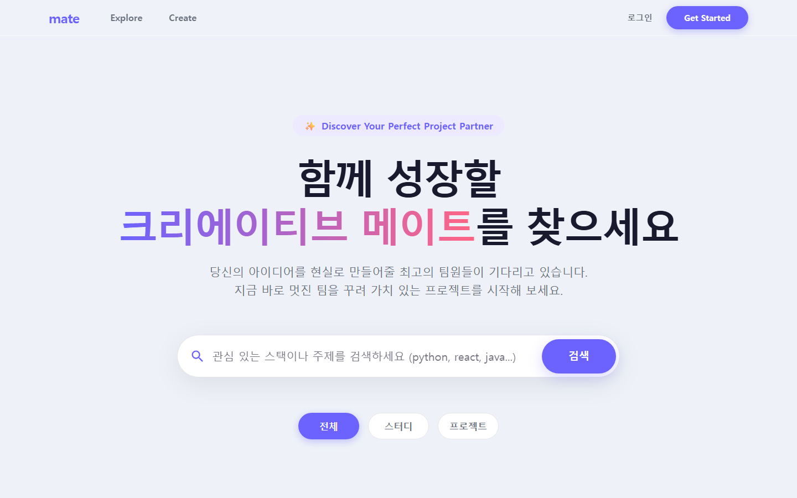
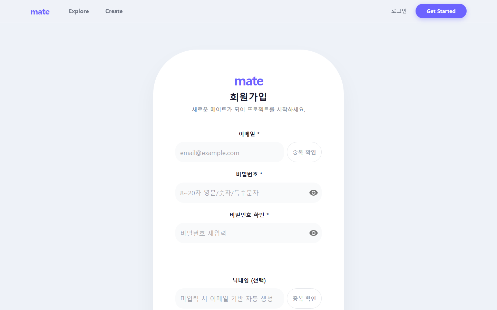
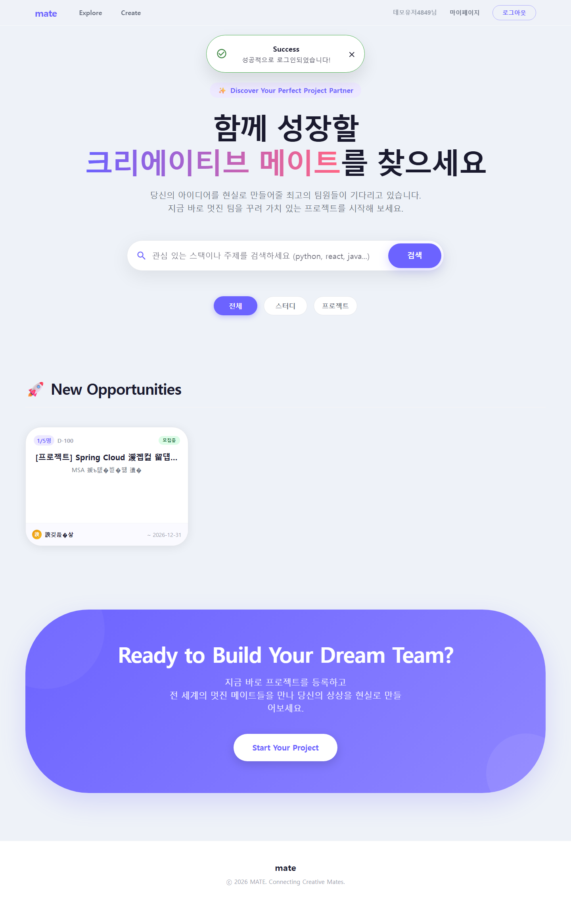
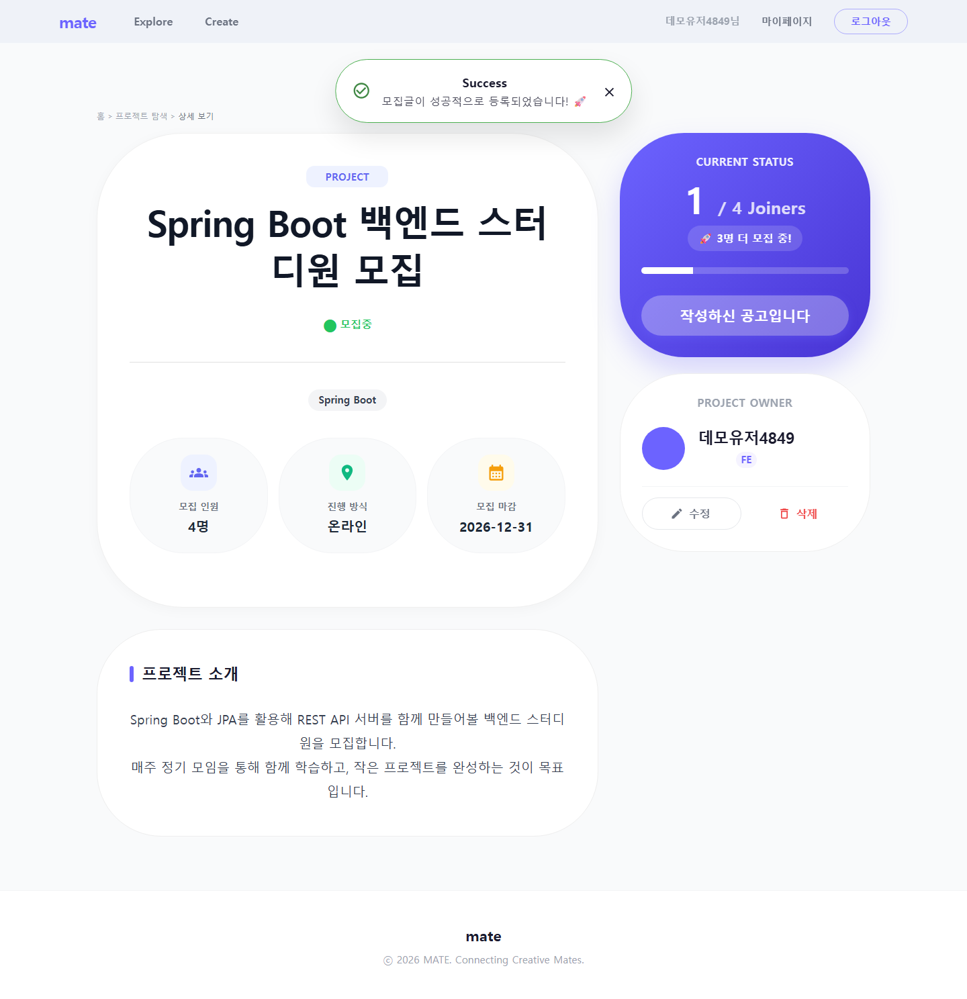
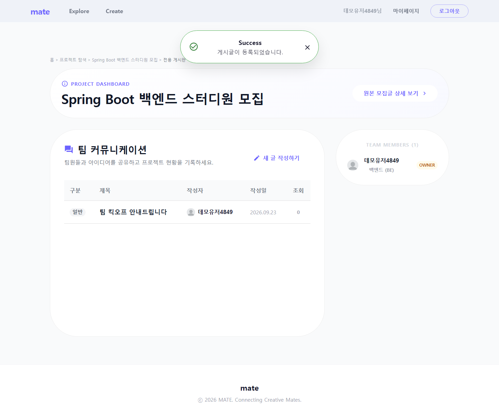
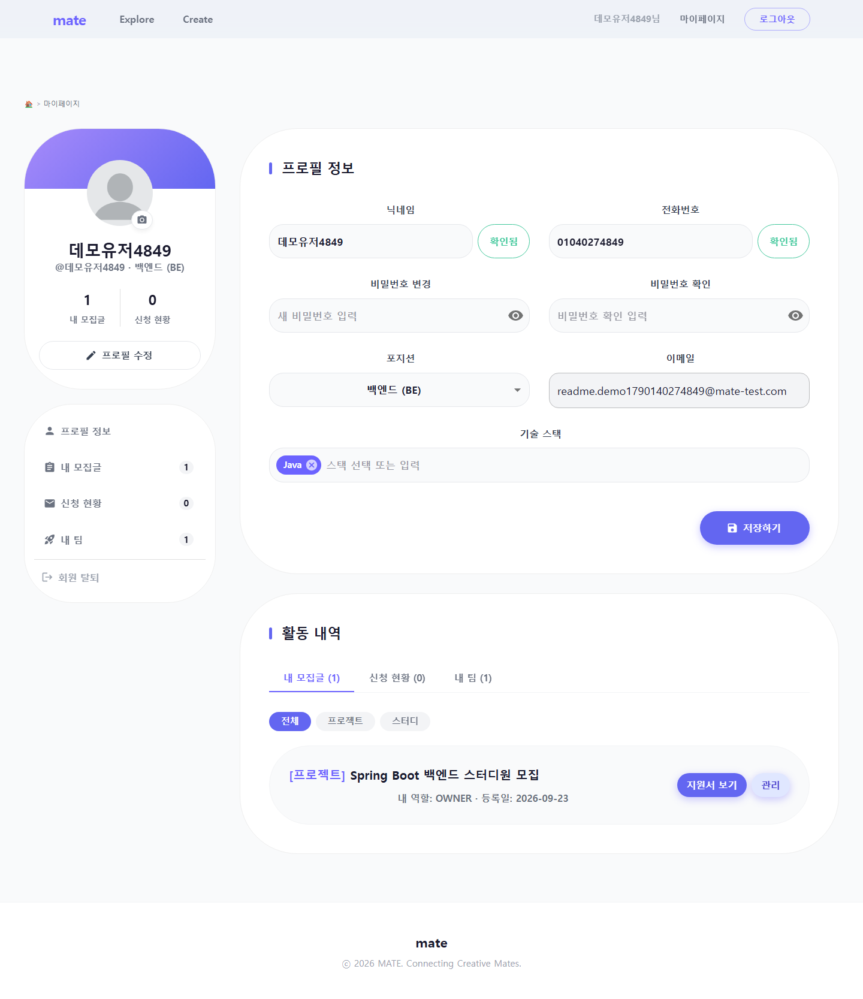
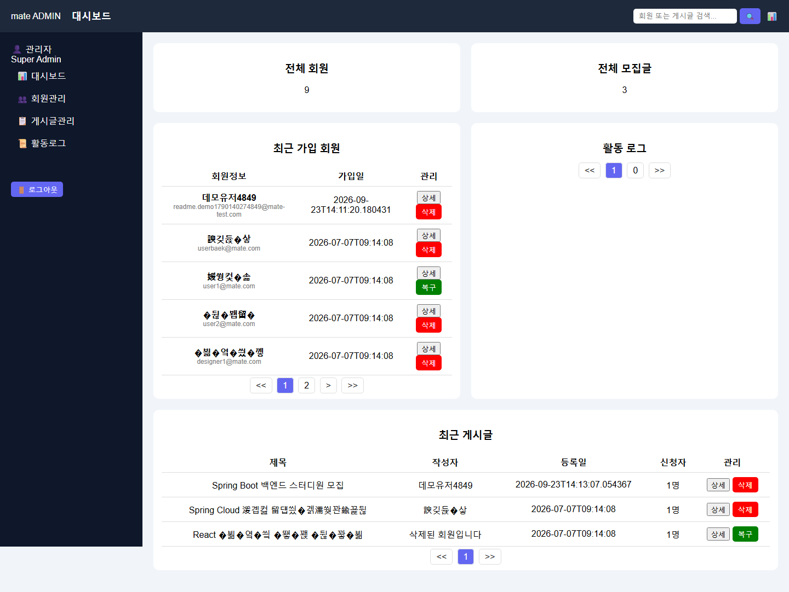
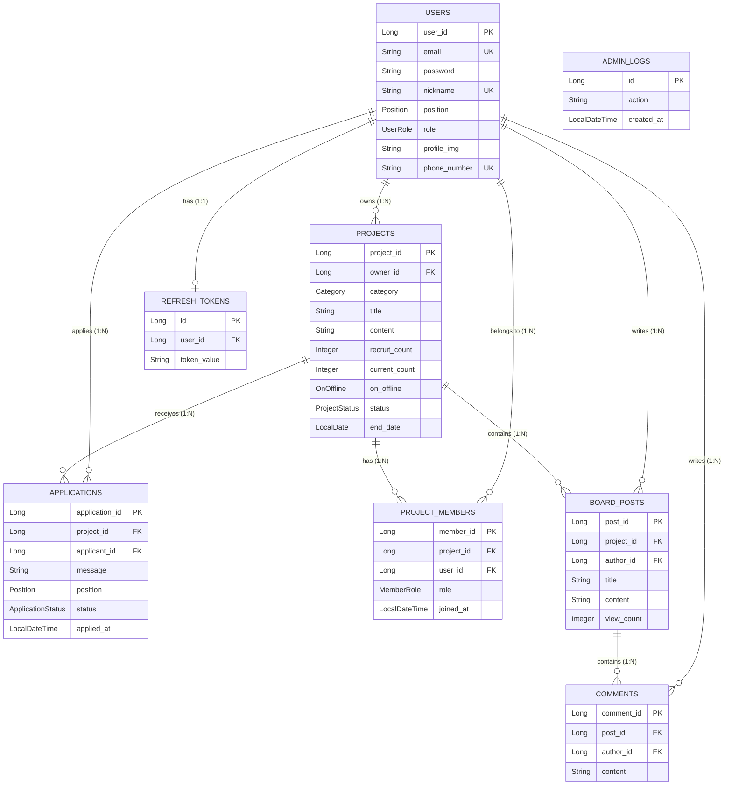

## 💻 Backend-MATE

팀 프로젝트 · 스터디원 모집을 위한 협업 매칭 플랫폼 **MATE**의 백엔드 저장소입니다.

<details>
<summary>목차</summary>

- [팀원 소개](#teamintro)
- [개요](#overview)
- [기술 스택](#skill)
- [실제 화면](#screenshot)
- [중요 기술 및 기능](#feature)
- [도메인 (ERD)](#erd)
- [프로젝트 구조](#structure)
- [설치 및 실행 방법](#install)

</details>

---

## <h3 id="teamintro">1. 📢 팀원 소개 및 역할 분담</h3>

백엔드 개발자 3명, 프론트엔드 개발자 2명, 풀스택 개발자 1명, 총 6명으로 구성된 팀입니다.

| 👑홍지호 | 💻이예린 | 🔎윤형진 | 💡김현석A | 🪄박진아 | 🎨장현준 |
| :---: | :---: | :---: | :---: | :---:  | :---: |
| |  |  |  |  |  |
|  |  |  |  |  |  |
| 유저/마이페이지 도메인, 인증(로그인·재발급·로그아웃) 비즈니스 로직, 게시판·댓글 도메인, 소프트 삭제 정책 설계·적용, 공통 응답/예외 처리 | DB/JPA 설계, Spring Security 인증/인가(JWT 발급·검증), 문서화 | 모집글/지원서 도메인 API 개발, JPA 성능 튜닝, 페이징/검색 최적화 | React 환경 초기 세팅, 전역 상태관리(Redux) 연동, 로그인/회원가입 UI 구현 | 메인/상세 페이지 반응형 UI 구현, Axios 연동 및 클라이언트 에러 핸들링 | Thymeleaf 기반 서버사이드 관리자(admin) 페이지 구현 및 전체 서비스 QA |
| github:<br> [hongjiho5148](https://github.com/hongjiho5148)| github:<br> [nirey-l](https://github.com/nirey-l) | github:<br> [hjyouns](https://github.com/hjyouns) | github:<br> [Hyeonseok93](https://github.com/Hyeonseok93)| github:<br> [pjcosmos](https://github.com/pjcosmos) | github:<br> [Jangdochi](https://github.com/Jangdochi) |

---

## <h3 id="overview">2. 📖 개요</h3>

- **목적**: 효율적인 팀 매칭과 스터디 모집 과정을 자동화하고 관리하기 위한 RESTful API 서버
- **서비스 소개**: 사용자가 자신의 기술 스택과 포지션을 설정해 팀원을 찾거나, 원하는 프로젝트에 지원해 함께 협업할 수 있는 플랫폼
- 신속한 팀원 모집 및 지원 프로세스 제공
- 기술 스택 및 포지션 기반의 사용자 프로필 관리
- 프로젝트별 게시판과 댓글을 통한 원활한 소통 지원
- 관리자 대시보드를 통한 서비스 모니터링, 삭제 데이터 조회 및 복구

---

## <h3 id="skill">3. 🍀 기술 스택 (Tech Stack)</h3>

### Core
- **Language**: Java 17
- **Framework**: Spring Boot 3.5.x
- **Build Tool**: Maven

### Database & Persistence
- **Database**: MariaDB (Production/Dev), H2 (Test)
- **ORM**: Spring Data JPA (Hibernate)
- **Dynamic Query**: QueryDSL
- **Migration/Script**: Flyway (준비됨), JPA DDL-Auto, data.sql

### Security
- **Authentication**: Spring Security, JWT (JSON Web Token)
- **Encryption**: BCryptPasswordEncoder

### Infrastructure & Others
- **File Storage**: Cloudinary (프로필 이미지 업로드)
- **Monitoring**: Spring Boot Actuator, Spring Boot Admin
- **Admin Page**: Thymeleaf, Thymeleaf Extras Spring Security
- **Library**: Lombok, Jakarta Validation
- **Test**: JUnit5, Spring Boot Test, @DataJpaTest

---

## <h3 id="screenshot">4. 🖼️ 실제 화면</h3>

| 화면 | 설명 |
| :---: | --- |
|  | 랜딩 페이지 |
|  | 회원가입 |
|  | 로그인 후 모집글 목록 (검색/카테고리 필터) |
|  | 모집글 상세 (모집 현황, 방장 정보) |
|  | 프로젝트 전용 게시판 |
|  | 마이페이지 (프로필, 활동 내역) |
|  | 관리자 대시보드 (회원/게시글 관리, 삭제 데이터 복구) |

---

## <h3 id="feature">5. 🛠️ 중요 기술 및 기능</h3>

<details>
<summary>🔐 인증 및 회원 (Auth & User)</summary>

- JWT 기반 Access Token(1시간) / Refresh Token(7일) 이중 발급, Refresh Token은 DB에서 별도 관리해 로그아웃·탈퇴 시 즉시 무효화
- `POST /api/auth/signup`: 회원가입 (닉네임 미입력 시 자동 생성, 기본 프로필 이미지 자동 할당)
- `POST /api/auth/login`: 로그인 및 JWT 발급
- `POST /api/auth/refresh`: 토큰 재발급 (DB 존재 여부 + 서명/만료 이중 검증)
- `GET/PATCH /api/users/me`: 내 정보 조회 및 수정
- `GET /api/users/me/posts/owned`: 내가 생성한 프로젝트 목록 조회
</details>

<details>
<summary>📋 프로젝트 모집 (Project)</summary>

- `POST /api/projects`: 모집글 생성
- `GET /api/projects`: 전체 목록 조회 (카테고리·키워드·온오프라인·모집상태·기술스택 필터링, QueryDSL 기반 동적 쿼리)
- `PATCH /api/projects/{id}/close`: 모집 수동 마감
- `PATCH /api/projects/{id}/reopen`: 프로젝트 재모집 시작
</details>

<details>
<summary>✉️ 지원 및 멤버 (Application & Member)</summary>

- `POST /api/applications/{projectId}`: 프로젝트 지원하기
- `PATCH /api/applications/{id}/status`: 지원서 상태 변경 (승인/거절)
- `GET /api/posts/{projectId}/members`: 프로젝트 참여 멤버 조회
</details>

<details>
<summary>💬 게시판 및 댓글 (Board & Comment)</summary>

- `GET/POST /api/posts/{projectId}/board`: 프로젝트 내 게시글 목록 조회 및 작성
- `POST /api/posts/{projectId}/board/{postId}/comments`: 댓글 작성
- 프로젝트 멤버십 기반 접근 제어, 작성자/방장 이중 권한 체계
- 게시글 목록 조회 시 작성자 조회로 발생하던 N+1 문제를 `@EntityGraph`로 해결
</details>

<details>
<summary>🗑️ 소프트 삭제 정책</summary>

- 회원, 모집글, 지원서, 게시글, 댓글, 프로젝트 멤버 6개 도메인에 물리 삭제 대신 상태 변경 기반의 소프트 삭제 정책을 통일 적용
- 일반 조회에서는 삭제된 데이터가 자동으로 제외되며, 관리자 화면에서는 삭제 여부와 무관하게 조회 및 복구 가능
- 회원탈퇴 시 소유 프로젝트 및 작성 콘텐츠까지 참조 관계를 고려한 순서로 연쇄 처리
</details>

<details>
<summary>🛠️ 관리자 (Admin)</summary>

- `GET /admin/dashboard`: 전체 서비스 현황 대시보드
- `POST /admin/users/restore/{id}`: 삭제된 회원 및 데이터 복구
</details>

<details>
<summary>✅ 공통 응답 및 예외 처리</summary>

- 모든 API의 성공/실패 응답을 `SuccessResponse` / `ErrorResponse`로 통일
- 도메인별 에러 코드 체계(`ErrorCode`)와 전역 예외 처리(`@RestControllerAdvice`)로 일관된 에러 응답 제공
- REST 시맨틱에 맞게 부분 수정 API를 PUT에서 PATCH로 정리
</details>

---

## <h3 id="erd">6. 📚 도메인 (ERD)</h3>

본 프로젝트의 **Entity 설계 및 ERD 개요**입니다. 비즈니스 도메인을 객체-관계 매핑(ORM)으로 정의하여 확장성과 유지보수성을 고려해 설계되었습니다.


```mermaid
erDiagram
    USERS {
        Long user_id PK
        String email UK
        String password
        String nickname UK
        Position position
        UserRole role
        String profile_img
        String phone_number UK
    }

    PROJECTS {
        Long project_id PK
        Long owner_id FK
        Category category
        String title
        String content
        Integer recruit_count
        Integer current_count
        OnOffline on_offline
        ProjectStatus status
        LocalDate end_date
    }

    APPLICATIONS {
        Long application_id PK
        Long project_id FK
        Long applicant_id FK
        String message
        Position position
        ApplicationStatus status
        LocalDateTime applied_at
    }

    PROJECT_MEMBERS {
        Long member_id PK
        Long project_id FK
        Long user_id FK
        MemberRole role
        LocalDateTime joined_at
    }

    BOARD_POSTS {
        Long post_id PK
        Long project_id FK
        Long author_id FK
        String title
        String content
        Integer view_count
    }

    COMMENTS {
        Long comment_id PK
        Long post_id FK
        Long author_id FK
        String content
    }

    REFRESH_TOKENS {
        Long id PK
        Long user_id FK
        String token_value
    }

    ADMIN_LOGS {
        Long id PK
        String action
        LocalDateTime created_at
    }

    USERS ||--o{ PROJECTS : "owns (1:N)"
    USERS ||--o{ APPLICATIONS : "applies (1:N)"
    PROJECTS ||--o{ APPLICATIONS : "receives (1:N)"
    USERS ||--o{ PROJECT_MEMBERS : "belongs to (1:N)"
    PROJECTS ||--o{ PROJECT_MEMBERS : "has (1:N)"
    USERS ||--o{ BOARD_POSTS : "writes (1:N)"
    PROJECTS ||--o{ BOARD_POSTS : "contains (1:N)"
    USERS ||--o{ COMMENTS : "writes (1:N)"
    BOARD_POSTS ||--o{ COMMENTS : "contains (1:N)"
    USERS ||--o| REFRESH_TOKENS : "has (1:1)"
```

모든 도메인 엔티티는 `BaseEntity`(`createdAt`, `updatedAt`, `deletedAt`)를 상속해 소프트 삭제 정책을 공통으로 적용합니다.

---

## <h3 id="structure">7. 📦 프로젝트 구조</h3>

```text
src/main/java/com/rookies5/Backend_MATE/
├── common/              # 공통 응답 처리 (SuccessResponse)
├── config/              # Security, Web, Cloudinary, QueryDSL 등 설정 클래스
├── controller/          # REST API 컨트롤러
├── dto/                 # Request/Response Data Transfer Object
├── entity/              # JPA 엔티티 및 Enum (BaseEntity 상속)
├── exception/           # 전역 예외 처리 및 커스텀 에러 코드
├── mapper/              # Entity <-> DTO 변환 로직 (Mapper)
├── repository/          # Spring Data JPA 리포지토리 (QueryDSL 커스텀 구현 포함)
├── security/            # JWT 및 시큐리티 관련 유틸리티 (JwtTokenProvider 등)
└── service/             # 비즈니스 로직 인터페이스 및 구현체 (impl)
```

---

## <h3 id="install">8. 🚀 설치 및 실행 방법</h3>

### 환경 변수 설정
`src/main/resources/application-dev.properties` 파일을 확인하여 다음 설정을 환경에 맞게 수정합니다.

```properties
# MariaDB 설정
spring.datasource.url=jdbc:mariadb://localhost:3306/mate_db
spring.datasource.username=YOUR_USERNAME
spring.datasource.password=YOUR_PASSWORD

# JWT 설정
jwt.secret=your_very_long_random_secret_key_here

# Cloudinary 설정 (이미지 업로드 사용 시)
cloudinary.cloud-name=your_cloud_name
cloudinary.api-key=your_api_key
cloudinary.api-secret=your_api_secret
```

### 실행 단계
1. **Repository Clone**
   ```bash
   git clone https://github.com/hongjiho5148/miniproject2-backend.git
   cd miniproject2-backend
   ```
2. **Database 생성**
   - MariaDB에 `mate_db` 데이터베이스를 생성합니다.
3. **Maven Build & Run**
   ```bash
   # Windows (cmd/powershell)
   mvnw.cmd spring-boot:run

   # Linux/macOS
   ./mvnw spring-boot:run
   ```
4. **API 접속**
   - 기본 포트: `http://localhost:8080`
